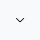
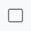
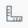
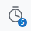
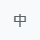
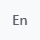

# FShot

[繁體中文](https://github.com/codemee/fshot/blob/main/README.md) | [English](https://github.com/codemee/fshot/blob/main/README.en.md)

FShot 是以 Python 實作的桌面截圖工具，主打全域快捷鍵、系統匣常駐、多頁籤編輯與快速複製/存檔。目前支援 Windows 與 macOS；平台權限與驗收方式請閱讀 [Cross-Platform Notes](https://github.com/codemee/fshot/blob/main/docs/cross-platform.md)。

## Current Status

- Windows: 主要功能已實作並經手動測試調整。
- macOS: 已實作 Quartz 全域快捷鍵、螢幕擷取、焦點視窗、視窗/控制項選取與游標擷取。
- Linux: 僅保留基本架構與部分通用能力，尚未作為主要目標平台。

## Quick Start

### 桌面應用程式

一般使用者建議從 [GitHub Releases](https://github.com/codemee/fshot/releases) 下載：

- Windows 10/11 x64：單一可攜式 `FShot-<版本>-windows-x64.exe`，不需要 Python。
- Apple Silicon Mac：`FShot-<版本>-macos-arm64.dmg`，開啟後將 `FShot.app` 拖入 Applications；不支援 Intel Mac。

這些個人專案版本沒有 Authenticode 或 Apple Developer ID 等可信任發行者簽章，也未經 Apple notarization。Windows 可能顯示 SmartScreen 警告；macOS 第一次開啟時需到「系統設定 → 隱私權與安全性」選擇「仍要打開」，並授予「螢幕錄製」與「輔助使用」權限。下載後可用同一個 Release 內的 `SHA256SUMS.txt` 核對檔案。完整步驟請閱讀 [Windows 安裝說明](docs/install-windows.md) 或 [macOS 安裝說明](docs/install-macos.md)。

### 從 PyPI 執行

FShot 可從 [PyPI](https://pypi.org/project/fshot/) 安裝。不需安裝即可使用 `uvx` 執行最新正式版本：

```powershell
uvx fshot
```

第一次執行會從 PyPI 下載套件並建立 uv 快取環境，後續會重用快取。臨時試用建議使用 `uvx`，若要長期使用則安裝為 uv tool。

使用 uv 從 PyPI 安裝：

```powershell
uv tool install fshot
fshot
```

安裝後可直接執行 `fshot`；更新至 PyPI 最新版本：

```powershell
uv tool upgrade fshot
```

使用 `uv tool install` 安裝時，FShot 啟動後會在背景每日檢查一次 PyPI。系統匣選單可手動「檢查更新…」或停用自動檢查；發現新版時可選擇更新並重新啟動、稍後處理或略過該版本。更新前若有尚未儲存的截圖，FShot 會先要求確認。打包版則檢查 GitHub Release 並開啟下載頁面，不會自行覆寫未簽章的 EXE 或 App。`uvx` 與原始碼開發環境只提供手動更新指引。

若要直接從 GitHub 測試 `main` 的最新開發成果：

```powershell
uv tool install --force "fshot @ git+https://github.com/codemee/fshot.git@main"
```

從原始碼啟動開發環境：

```powershell
uv sync
uv run fshot
```

程式啟動後會隱藏主視窗並留在系統匣。雙擊系統匣圖示可顯示編輯視窗，右鍵選單可退出。

### 工具列圖示與功能

下表依工具列由左至右排列，圖示直接由程式的工具列繪圖匯出，使用淺色主題示意。將滑鼠停在按鈕上可查看目前語言的提示與快捷鍵；線條樣式、顏色、延遲及模式圖示會隨設定改變。下列快捷鍵以 Windows 為例。

| 圖示 | 功能 | 操作方式／快捷鍵 |
| --- | --- | --- |
|  | 自由畫筆 | 在圖片上拖曳繪製自由線條。<kbd>Alt</kbd>+<kbd>P</kbd> |
|  | 線條／箭頭 | 拖曳繪製直線，預設以實心圓起始、箭頭結束。<kbd>Alt</kbd>+<kbd>L</kbd> |
|  | 線條端點樣式 | 點擊線條按鈕右側的小箭頭，分別設定起點與終點為無、箭頭或實心圓。 |
|  | 矩形 | 拖曳繪製矩形框。<kbd>Alt</kbd>+<kbd>R</kbd> |
|  | 丈量像素 | 拖曳顯示橫向、縱向像素差；放開保留讀值，重新丈量或切換工具時清除。讀值不寫入圖片。<kbd>Alt</kbd>+<kbd>D</kbd> |
|  | 文字 | 在圖片上加入文字。<kbd>Alt</kbd>+<kbd>T</kbd> |
|  | 馬賽克 | 拖曳選取範圍，以馬賽克遮蔽內容。<kbd>Alt</kbd>+<kbd>M</kbd> |
|  | 順時針旋轉 | 將圖片順時針旋轉 90°。<kbd>Alt</kbd>+<kbd>C</kbd> |
|  | 水平鏡射 | 將圖片左右翻轉。<kbd>Alt</kbd>+<kbd>H</kbd> |
|  | 垂直鏡射 | 將圖片上下翻轉。<kbd>Alt</kbd>+<kbd>V</kbd> |
|  | 縮小圖片 | 開啟面板輸入 1–99%，實際縮小圖片像素尺寸，可復原。<kbd>Alt</kbd>+<kbd>S</kbd> |
|  | 線寬與顏色 | 開啟面板調整繪圖線寬及顏色，亦可選擇自訂顏色。 |
|  | 復原 | 還原前一次圖片編輯。<kbd>Ctrl</kbd>+<kbd>Z</kbd> |
|  | 複製圖片 | 將目前圖片複製至剪貼簿。<kbd>Ctrl</kbd>+<kbd>C</kbd> |
|  | 存檔 | 儲存目前圖片；已有來源路徑時寫回原檔，新圖片則選擇儲存位置。<kbd>Ctrl</kbd>+<kbd>S</kbd> |
|  | 另存新檔 | 選擇另一個檔名或位置儲存圖片。<kbd>Ctrl</kbd>+<kbd>Shift</kbd>+<kbd>S</kbd> |
|  | 放大顯示 | 放大編輯器中的圖片顯示，不改變圖片像素尺寸。<kbd>Ctrl</kbd>+<kbd>+</kbd>／<kbd>Ctrl</kbd>+<kbd>=</kbd> |
|  | 縮小顯示 | 縮小編輯器中的圖片顯示，不改變圖片像素尺寸。<kbd>Ctrl</kbd>+<kbd>-</kbd> |
|   | 擷取時包含游標 | 單擊切換是否將游標加入截圖；有勾號表示啟用。 |
|   | 延遲擷取 | 開啟面板選擇關閉、1、3、5 秒或自訂 0–60 秒；圖示數字表示目前秒數。虛擬模式的作用中視窗設定延遲後會開啟操作預覽。 |
|   | 實體／虛擬螢幕 | 單擊切換，實線表示實體、虛線表示虛擬，設定會保留。虛擬模式僅支援 Windows，缺少螢幕或驅動時會詢問是否建立／安裝。詳見下方虛擬擷取說明。 |
|  | 設定擷取快捷鍵 | 設定四種擷取模式及重複擷取的 <kbd>Ctrl</kbd>／<kbd>Shift</kbd>／<kbd>Alt</kbd> 加 <kbd>A</kbd>–<kbd>Z</kbd> 組合；<kbd>Shift</kbd> 須搭配 <kbd>Ctrl</kbd> 或 <kbd>Alt</kbd>。按 OK 且註冊成功後套用，Cancel 不變更；「使用預設」重設面板欄位。 |
|    | 主題 | 單擊循環切換「跟隨系統 → 淺色 → 深色」，並保留選擇；太陽與月亮組合表示跟隨系統。 |
|    | 語言 | 單擊循環切換「跟隨系統 → 繁體中文 → English」，並保留選擇；圖示依序為文/A、中、En。 |

macOS 的復原、複製與存檔使用 <kbd>⌘</kbd> 組合鍵；顯示縮放沿用表列 <kbd>Ctrl</kbd> 組合。貼上、重設縮放、頁籤重新命名及拖曳裁切沒有工具列按鈕，請參閱下方編輯快捷鍵與圖片操作說明。文件圖示需要更新時，可執行 `uv run python scripts/export_toolbar_icons.py` 重新匯出。

圖片也可透過拖放或剪貼簿加入編輯器：拖放圖片會以完整檔名建立頁籤、保留來源路徑並在修改後寫回原檔；直接貼上影像或從檔案管理器複製圖片後貼上，會以截圖時間格式建立新的未存檔頁籤。成功存檔後會記住檔案所在資料夾，其他尚未存檔的頁籤會從該資料夾開啟儲存交談窗。Windows/Linux 使用 <kbd>Ctrl</kbd>+<kbd>V</kbd>，macOS 使用 <kbd>⌘</kbd>+<kbd>V</kbd>。

## 虛擬 4K 螢幕擷取（Windows 實驗功能）

工具列的螢幕按鈕可切換「實體／虛擬」，實線螢幕圖示表示實體、虛線表示虛擬，選擇會保留至下次啟動。實體模式沿用原擷取流程；虛擬模式使用相同的快捷鍵，延遲作用中視窗擷取另提供下述操作預覽：

- <kbd>Ctrl</kbd>+<kbd>Shift</kbd>+<kbd>A</kbd>：記住按鍵當下的作用中視窗，依螢幕佔比移動及調整至虛擬螢幕，擷取後還原。
- <kbd>Ctrl</kbd>+<kbd>Shift</kbd>+<kbd>W</kbd>：在原螢幕選取視窗／控制項，移動其所屬視窗後擷取。控制項以原生 HWND 或 UI Automation 重新取得當下邊界；目標消失或無法追蹤時顯示錯誤。
- <kbd>Ctrl</kbd>+<kbd>Shift</kbd>+<kbd>F</kbd>：直接擷取游標所在螢幕的全螢幕畫面；實體／虛擬模式皆相同，不移動或縮放視窗。
- <kbd>Ctrl</kbd>+<kbd>Shift</kbd>+<kbd>Q</kbd>：重複上一次成功的虛擬快捷鍵擷取；實體與虛擬模式各自記住前次擷取。
- <kbd>Ctrl</kbd>+<kbd>Shift</kbd>+<kbd>R</kbd>：虛擬模式尚不支援，會提示切換為實體模式。

虛擬視窗擷取會在移動後等待畫面重新繪製，並套用既有延遲與游標設定。擷取完成、取消或錯誤後還原原位置、尺寸與視窗狀態。功能表等失去焦點即消失的暫態內容仍可能無法在虛擬螢幕保留；凍結的原畫面僅用於選取，不會當作高解析度輸出。

### 作用中視窗的延遲操作預覽（Windows 實驗功能）

此功能讓你在實體螢幕操作已移至虛擬螢幕的視窗，例如展開功能表，等倒數結束後再擷取高解析度畫面。僅在 **Windows、虛擬模式、作用中視窗擷取、延遲大於 0** 時啟用。

#### 啟動步驟

1. 點擊工具列的螢幕按鈕，切換至虛擬模式（虛線螢幕圖示）。
2. 點擊「延遲」，設定大於 0 的秒數，建議先用 **5 或 10 秒**。
3. 將游標留在實體螢幕，切換到要擷取的程式。
4. 按下 <kbd>Ctrl</kbd>+<kbd>Shift</kbd>+<kbd>A</kbd>，FShot 會將作用中視窗移至虛擬螢幕，並在實體螢幕顯示操作預覽。

**第一張預覽畫面就緒後才開始倒數。** 預覽不取得焦點，鍵盤仍操作目標程式。

#### 預覽期間操作

| 操作 | 結果 |
| --- | --- |
| 移動滑鼠 | 操作轉送至虛擬螢幕，預覽以十字游標顯示位置。 |
| 點擊、拖曳、捲動 | 操作目標程式，可在倒數期間展開功能表。 |
| 使用鍵盤 | 輸入仍送至目標程式。 |
| 按 <kbd>Esc</kbd> | 取消擷取，關閉預覽並還原視窗與游標。 |
| 切換到其他程式、目標消失或輸入轉送失敗 | 停止擷取並還原。 |

#### 擷取與還原

倒數結束後，FShot 依序執行：

1. 擷取目標視窗，以及其原生功能表／新開啟的所屬彈出視窗。
2. 關閉操作預覽；預覽本身不會進入輸出圖片。
3. 還原視窗原本的位置、長寬與狀態，並還原游標位置。

#### 限制與效能

- **適用範圍**：延遲為 0、選取子元件及全螢幕擷取仍使用原流程。
- **程式相容性**：管理員權限較高的程式可能不接受輸入轉送；自繪功能表或特殊彈出視窗的邊界辨識需手動驗收。
- **預覽流暢度**：背景更新以每秒 30 張為目標，只保留最新畫面，並依實體螢幕預覽尺寸縮小。實際速度取決於系統與顯示驅動。
- **輸出畫質**：最後截圖仍以虛擬螢幕原始像素擷取，預覽縮小不影響輸出解析度。

### 驅動程式與虛擬螢幕建立

#### 切換時的檢查流程

點擊工具列螢幕按鈕切換至虛擬模式後，FShot 依系統狀態處理：

| 系統狀態 | FShot 的處理方式 | 使用者操作 |
| --- | --- | --- |
| 已有啟用的虛擬螢幕 | 直接使用像素面積最大的虛擬螢幕。 | 不需額外設定。 |
| 已有支援的驅動，但沒有啟用的虛擬螢幕 | 詢問是否建立 3840 × 2160 延伸螢幕。 | 同意建立，並在出現 UAC 時確認。 |
| 找不到支援的驅動 | 詢問是否安裝並建立 4K 螢幕；同意後以 WinGet 下載官方套件、安裝，再建立螢幕。 | 同意安裝與建立，並在出現 UAC 時確認。 |
| 使用者取消或程序失敗 | 維持實體模式；失敗時提供手動安裝指引。 | 可依指引處理後再切換。 |

#### 驅動與設定管理

- **自動安裝支援**：VirtualDrivers／MikeTheTech Virtual Display Driver，使用 Virtual Driver Control 隨附的已簽章安裝工具。
- **建立前備份**：備份 `C:\VirtualDisplayDriver\vdd_settings.xml`，再加入 4K 模式並設定一個虛擬顯示器。
- **重新安裝**：保留原設定。
- **其他虛擬驅動**：可使用已啟用的螢幕，但需自行建立。
- **操作入口**：統一使用工具列切換與原快捷鍵，系統匣不提供額外的虛擬螢幕擷取入口。

### 視窗大小與顯示縮放

#### 視窗移動與尺寸換算

1. 選擇像素面積最大的啟用中虛擬螢幕。
2. 移動前記錄視窗原本的位置、長寬與狀態。
3. 寬、高分別依來源與目標螢幕尺寸換算，維持原本的螢幕佔比：

   `目標視窗寬 = 原視窗寬 ÷ 來源螢幕寬 × 目標螢幕寬`

   `目標視窗高 = 原視窗高 ÷ 來源螢幕高 × 目標螢幕高`

4. 擷取完成、取消或錯誤後，依紀錄還原位置、長寬與狀態，包含原本的最大化狀態。

#### 擷取範圍

| 擷取模式 | 輸出範圍 |
| --- | --- |
| 視窗擷取 | 目標視窗範圍；延遲操作預覽會一併包含可辨識的原生功能表／新開啟的所屬彈出視窗。 |
| 全螢幕擷取 | 游標所在的當前螢幕，實體／虛擬模式皆相同。 |

#### Windows 顯示縮放

顯示縮放由使用者在 Windows 設定；FShot 不會修改系統縮放或 DPI。

| 縮放比例 | 畫面特性 |
| --- | --- |
| 100% | 能容納較多內容。 |
| 200% | 適合以更多像素呈現支援 DPI 的介面與文字。 |

#### 使用限制

- **最小化視窗**：請先還原再擷取。
- **尺寸超出可用範圍**：換算後無法放入目標螢幕時會中止，請先縮小來源視窗。
- **畫質與布局**：取決於目標程式的 DPI 支援及尺寸限制；舊式程式或低解析度素材可能無法增加細節。
- **平台支援**：macOS 尚未提供此移動與預覽流程。

## Windows Shortcuts

- <kbd>Ctrl</kbd>+<kbd>Shift</kbd>+<kbd>Q</kbd>: 重複前一次的截圖方式（矩形區域與選取的視窗／控制項會沿用前次目標，可在設定面板自訂）
- <kbd>Ctrl</kbd>+<kbd>Shift</kbd>+<kbd>A</kbd>: 擷取目前焦點視窗
- <kbd>Ctrl</kbd>+<kbd>Shift</kbd>+<kbd>R</kbd>: 擷取矩形區域
- <kbd>Ctrl</kbd>+<kbd>Shift</kbd>+<kbd>F</kbd>: 擷取全螢幕
- <kbd>Ctrl</kbd>+<kbd>Shift</kbd>+<kbd>W</kbd>: 選取視窗或控制項後擷取

macOS 使用相同的 <kbd>Ctrl</kbd>+<kbd>Shift</kbd> 字母組合。獨立 App 請授權 `FShot.app`；透過 `uv`／`uvx` 執行時，系統設定中的授權對象通常是啟動指令所在的 App，例如「終端機」、iTerm2 或 IDE。授權後請完全結束並重新開啟 FShot 或該宿主 App。

編輯工具快捷鍵：

- <kbd>Alt</kbd>+<kbd>P</kbd>: 自由畫筆
- <kbd>Alt</kbd>+<kbd>L</kbd>: 線條
- <kbd>Alt</kbd>+<kbd>R</kbd>: 矩形
- <kbd>Alt</kbd>+<kbd>D</kbd>: 丈量像素
- <kbd>Alt</kbd>+<kbd>T</kbd>: 文字
- <kbd>Alt</kbd>+<kbd>M</kbd>: 馬賽克
- <kbd>Alt</kbd>+<kbd>C</kbd>: 順時針旋轉 90°
- <kbd>Alt</kbd>+<kbd>S</kbd>: 依比例縮小圖片
- <kbd>Alt</kbd>+<kbd>H</kbd>: 水平鏡射
- <kbd>Alt</kbd>+<kbd>V</kbd>: 垂直鏡射
- <kbd>Ctrl</kbd>+<kbd>+</kbd> / <kbd>Ctrl</kbd>+<kbd>=</kbd>: 放大
- <kbd>Ctrl</kbd>+<kbd>-</kbd>: 縮小
- <kbd>Ctrl</kbd>+<kbd>0</kbd>: 重設縮放
- <kbd>F2</kbd>: 直接在目前標籤頁重新命名已存檔的檔案（macOS 使用 <kbd>Return</kbd>）

已存檔的標籤頁也可直接雙擊名稱進入重新命名；副檔名會保留不變。

## Project Docs

- [PRD](https://github.com/codemee/fshot/blob/main/PRD.md): 原始產品需求。
- [Architecture](https://github.com/codemee/fshot/blob/main/docs/architecture.md): 專案結構、主要模組與資料流。
- [uv-tool-updater 規格草案](docs/uv-tool-updater-spec.md)：更新套件的設計背景與目前 FShot 整合狀態。
- [Cross-Platform Notes](https://github.com/codemee/fshot/blob/main/docs/cross-platform.md): Windows/macOS/Linux 差異與 macOS 後續實作重點。

## Development

```shell
uv sync
uv run pytest -q
uv run python -m compileall src tests
```

若 FShot 正在執行，`compileall` 有時會因 `__pycache__` 或 executable 被鎖而失敗；先關閉或停止 `fshot.exe` 後再重跑。

## 桌面應用程式打包

FShot 使用 PyInstaller，而且必須在目標作業系統上建置；Windows runner 產生 x64 單一 EXE，Apple Silicon macOS runner 產生包含 `FShot.app` 與 Applications 捷徑的 arm64 DMG。專案不建立 Intel Mac 版本。

本機建置：

```powershell
uv sync
uv run python scripts/build_app.py
```

輸出位於 `dist/`。發布 GitHub Release 後，`Package desktop apps` 工作流程會自動在 Windows 與 macOS 原生 runner 執行測試和打包，再將 EXE、DMG 與 `SHA256SUMS.txt` 附加至該 Release。打包流程不使用 Authenticode、Apple Developer ID 或 notarization 憑證，因此發行檔仍會遇到前述 SmartScreen／Gatekeeper 提示。開發與手動補發細節請參閱 [Desktop Packaging](docs/packaging.md)。
